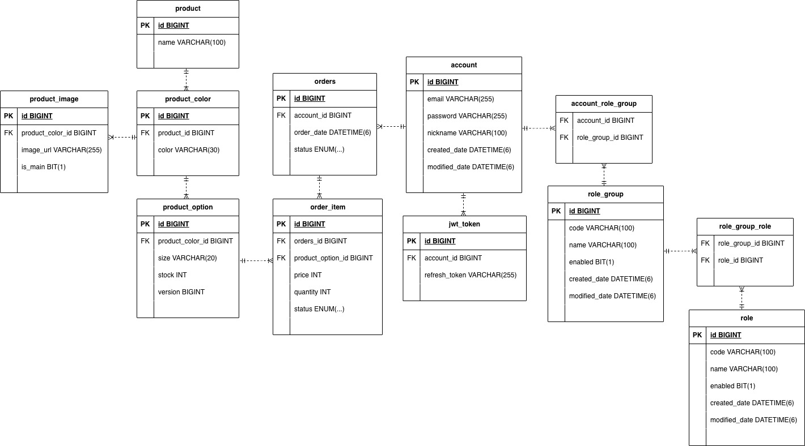
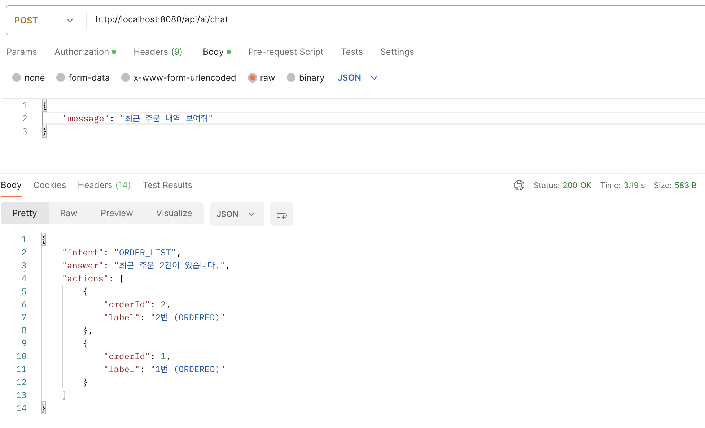
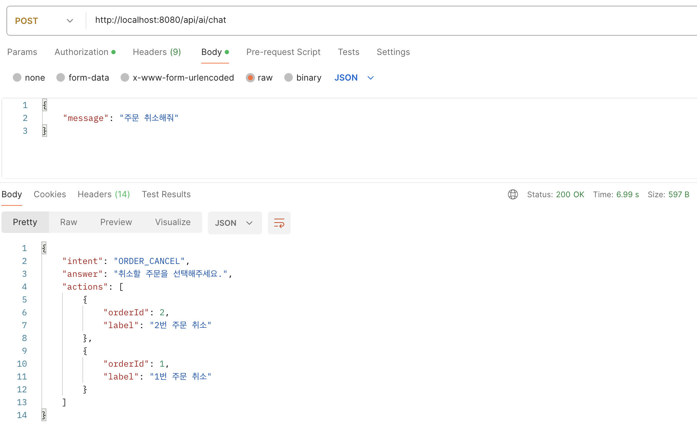

<br/>

# Demo Store
Spring Boot 기반의 상품 주문 API 프로젝트입니다. <br/>
회원가입, 로그인, 주문, 주문 취소 기능을 제공하며 JWT 인증, 재고 차감, 주문 조회를 다룹니다. <br/>
자연어 기반 요청을 처리하기 위해 AI intent 분류를 적용했습니다. <br/>
<br/>

## 프로젝트 소개
Spring Boot 기반의 상품 주문 API 프로젝트입니다. <br/>
회원가입, 로그인, 주문, 주문 취소 기능을 구현했으며 JWT 인증 방식을 적용했습니다. <br/>
또한 동시 주문 상황에서도 재고가 올바르게 차감되도록 Redis(Redisson)를 활용한 주문 처리 방식을 적용했습니다. <br/>
<br/>

## 핵심 기능
- 회원가입 / 로그인 / 주문 생성 / 주문 취소 / 주문 조회 
- JWT + Spring Security로 인증/인가 처리
- 주문 시 Redisson 분산 락으로 재고 정합성 보장
- AI intent 분류로 자연어 요청을 주문 조회/취소로 연결
<br/>

## 기술 스택
- Backend: Spring Boot, Spring Security, Spring Data JPA, Querydsl
- Database: MySQL
- Infra / Tooling: Redis(Redisson), Flyway, Swagger
- Test: JUnit5
<br/>

## 실행 방법
<br/>

### 1. MySQL / Redis 실행

```bash
docker-compose -f docker/docker-compose-mysql.yml up -d
```
<br/>

### 2. 데이터베이스 생성

```bash
docker exec -i mysql_store mysql -u root -plocal_root_password -e "CREATE DATABASE IF NOT EXISTS local_store;"
```
<br/>

### 3. DB 계정 생성 및 권한 부여

```bash
docker exec -i mysql_store mysql -u root -plocal_root_password -e "CREATE USER IF NOT EXISTS 'local_user'@'%' IDENTIFIED BY 'local_password';"
docker exec -i mysql_store mysql -u root -plocal_root_password -e "GRANT ALL PRIVILEGES ON local_store.* TO 'local_user'@'%';"
docker exec -i mysql_store mysql -u root -plocal_root_password -e "FLUSH PRIVILEGES;"
```
<br/>

### 4. 애플리케이션 실행

```bash
./gradlew build
java -jar build/libs/demo-store-0.0.1-SNAPSHOT.jar --spring.profiles.active=dev
```

샘플 데이터를 다시 넣고 시작하려면:

```bash
java -jar build/libs/demo-store-0.0.1-SNAPSHOT.jar --spring.profiles.active=dev,seed
```
<br/>

### 5. Swagger 접속

- `http://localhost:8080/swagger-ui/index.html`
<br/>

### 6. 테스트

- 인증, 주문, 주문 취소 API 동작을 테스트했습니다.
- 주문 처리 로직을 서비스 테스트로 검증했습니다.
- 동시 주문 상황의 재고 반영을 통합 테스트로 확인했습니다.

```bash
./gradlew test
```

로컬 Redis까지 띄운 상태에서 Redisson 동시성 통합 테스트만 확인하려면:

```bash
./gradlew test --tests com.store.service.OrderServiceRedissonIntegrationTest
```
<br/>

## 샘플 계정

- `user@store.com / 1234`
- `admin@store.com / 1234`
<br/>

## 프로젝트 구조

- `src/main/java/com/store/auth` : JWT 인증 처리
- `src/main/java/com/store/config` : 보안, CORS, Swagger, Querydsl 설정
- `src/main/java/com/store/controller` : Account, Order, AI Chat API
- `src/main/java/com/store/domain` : 계정, 주문, 상품 도메인
- `src/main/java/com/store/service` : 인증, 주문 처리 로직, AI Chat 처리 로직 
- `src/main/resources/db/migration` : Flyway 스키마 관리
- `src/main/resources/sql` : 샘플 데이터
- `src/test/java/com/store` : 서비스/컨트롤러 테스트
<br/>

## ERD



<br/>

## 결과 화면 
<br/>

### 최근 주문 내역 조회 
 <br/>
<br/>

### 주문 취소 요청 
 <br/>

<br/>
